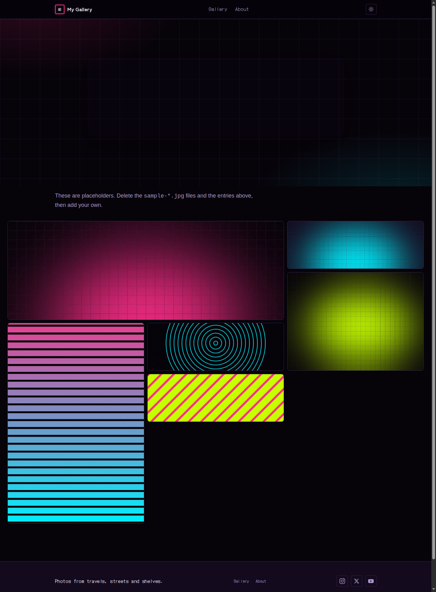

# gallery-template

A free, fast, public photo gallery you can have online in about ten minutes.
Hugo static site, a clean neutral design that lets the photos do the talking, a mosaic grid with a
keyboard-friendly lightbox, light and dark themes, and a browser-based
upload screen so you (or anyone you invite) can add photos without touching
code. No database, no server, no JavaScript framework, no monthly bill.



## Get it running

You need [Hugo](https://gohugo.io/installation/) (extended or standard, version
in `.tool-versions` or newer) and git.

```
git clone https://github.com/stuartdotnet/gallery-template.git my-gallery
cd my-gallery
hugo server -D
```

Open <http://localhost:1313>. You'll see twelve sample photos (landscapes,
people and still life, all from Unsplash; credits below).

## Make it yours

1. **`hugo.toml`**: set `title`, `baseURL`, `description`, `tagline`, `author`,
   and the two-letter `navCode` for the nav badge. Delete any social links you
   don't use.
2. **Delete the samples**: remove the sample `.jpg` files from `content/`
   and the matching entries in `content/_index.md`.
3. **Add your photos** (below).
4. **`content/about.md`**: say who you are and what people may do with the photos.
5. **Re-theme** (optional): every colour and font is a custom property at the
   top of `static/css/styles.css`. Change the `:root` block and the whole site
   follows.

## Add photos

### The code way

Drop the image file into `content/`, next to `_index.md`, then list it in the
front matter of `content/_index.md`:

```yaml
photos:
  - image: "shibuya-crossing.jpg"
    alt: "Shibuya crossing at night, signs reflected on wet pavement"
    caption: "Shibuya, Tokyo"
```

`alt` is required (screen readers and the lightbox use it). `caption` is
optional. Drop in the original: Hugo makes the grid thumbnail and the
full-size lightbox image (WebP) at build time, so there's no need to resize.
Photos appear in the order listed. Portrait and landscape shots get different
tile shapes automatically.

### The browser way (no code)

The site includes [Sveltia CMS](https://github.com/sveltia/sveltia-cms) at
`/contenteditor/`. Upload a photo, type the alt text, hit Save, and it commits
to your repo, which triggers a rebuild. The photo is live a minute or so later.

One-time setup:

1. Open `static/contenteditor/config.yml` and set `backend.repo` (your
   `owner/name`) and `site_url` (same as `baseURL`).
2. Push to GitHub and deploy (below).
3. Create a [fine-grained personal access token](https://github.com/settings/personal-access-tokens/new)
   limited to your gallery repo, with **Contents: Read and write**.
4. Go to `https://your-site/contenteditor/`, choose **Sign in with GitHub
   token**, paste the token.

To try it before deploying, run `hugo server`, open
`http://localhost:1313/contenteditor/` in Chrome or Edge, and choose
**Work with Local Repository**.

## Letting other people upload

Be clear about what this is: uploaders need to be able to push to your GitHub
repo. That makes it ideal for a family, a club, a team, or a handful of
photographers, and not at all suitable for anonymous strangers. To invite
someone, add them as a collaborator on the repo.

Tokens are fine for one or two people. For anyone less technical, set up the
real "Sign in with GitHub" button:

1. Deploy [sveltia-cms-auth](https://github.com/sveltia/sveltia-cms-auth) to
   Cloudflare Workers (its README has a one-click deploy).
2. Create a GitHub OAuth App with the callback URL `<worker URL>/callback`, and
   give the Worker its client ID and secret.
3. Add `base_url: https://your-worker.workers.dev` under `backend:` in
   `static/contenteditor/config.yml`.

One Worker can serve any number of sites.

## Deploy

Any static host works. The build command is `hugo --gc --minify` and the
output directory is `public`.

**Cloudflare Pages** (free, and what I use): connect the repo, set the build
command and output directory above, and add an environment variable
`HUGO_VERSION` matching `.tool-versions`. **Pin the version.** Hosts default
to a much older Hugo than you're running locally, and the mismatch either
fails the build or quietly changes the output. GitHub Pages, Netlify and
Vercel all work the same way.

Then set `baseURL` in `hugo.toml` to your real address.

## Good to know

- **Originals are not published.** The `[[cascade]]` block in `hugo.toml`
  stops Hugo copying your full-size originals into the public site. Only the
  resized WebP versions go out, and Hugo's re-encode drops EXIF data
  (including GPS location). If you remove that block, originals become
  downloadable by anyone who guesses the filename.
- **Repo size.** Phone photos are 3 to 10 MB each. A few hundred is fine.
  Thousands will make the repo slow to clone and the build slow to run. At
  that point, look at Git LFS or resizing before you commit.
- **Build time.** Hugo caches processed images, so only new photos cost time.
  The first build of a big gallery is the slow one.
- **Analytics** are off by default. Put a GA4 ID in `params.googleAnalytics`
  and a consent banner appears automatically.
- **Fonts**: one family, [Inter](https://rsms.me/inter/) (SIL OFL), self-hosted
  in `static/fonts/` as a variable font covering Latin and Latin Extended. To
  swap it, change `--font-sans` at the top of `styles.css`.
- **Themes**: light and dark, following the visitor's system setting until
  they pick one with the toggle. The lightbox is always dark.

## Layout

```
content/_index.md        the gallery: front matter lists the photos
content/*.jpg            your photo files, next to _index.md
content/about.md         the About page
layouts/partials/gallery.html   the mosaic and lightbox
static/css/styles.css    the whole design, tokens at the top
static/contenteditor/    the upload screen
hugo.toml                site settings
```

## Sample photo credits

The sample photos are from [Unsplash](https://unsplash.com/license) (free to
use, no permission needed) via [Lorem Picsum](https://picsum.photos):

| File | Photographer |
| --- | --- |
| `alpine-peak.jpg` | [Paul E. Harrer](https://unsplash.com/photos/TI-B-TNYJMU) |
| `hiker.jpg` | [Danka & Peter](https://unsplash.com/photos/tvicgTdh7Fg) |
| `bench-for-two.jpg` | [Charlie Foster](https://unsplash.com/photos/A88emaZe7d8) |
| `blossom.jpg` | [Rula Sibai](https://unsplash.com/photos/-vq7mi4oF0s) |
| `twin-lens-camera.jpg` | [Jennifer Trovato](https://unsplash.com/photos/baRYCsjO6z4) |
| `forks.jpg` | [Alejandro Escamilla](https://unsplash.com/photos/8yqds_91OLw) |
| `mountain-ridge.jpg` | [Go Wild](https://unsplash.com/photos/V0yAek6BgGk) |
| `daisies.jpg` | [Alexander Shustov](https://unsplash.com/photos/AHBiSKaENwc) |
| `sea-cliffs.jpg` | [Monika Majkowska](https://unsplash.com/photos/Nq8LdWC7HnM) |
| `dandelion.jpg` | [Coley Christine](https://unsplash.com/photos/GyvMk5pPDXI) |
| `birds-in-flight.jpg` | [Fré Sonneveld](https://unsplash.com/photos/liiqOto_Dw8) |
| `field-at-sunset.jpg` | [Kenneth Thewissen](https://unsplash.com/photos/D76DklsG-5U) |

## Licence

MIT. Use it, change it, sell it. The one condition is that you keep the copyright
notice and the `LICENSE` file with the code. No credit is needed on your
finished site. The bundled font keeps its own SIL Open Font Licence.
